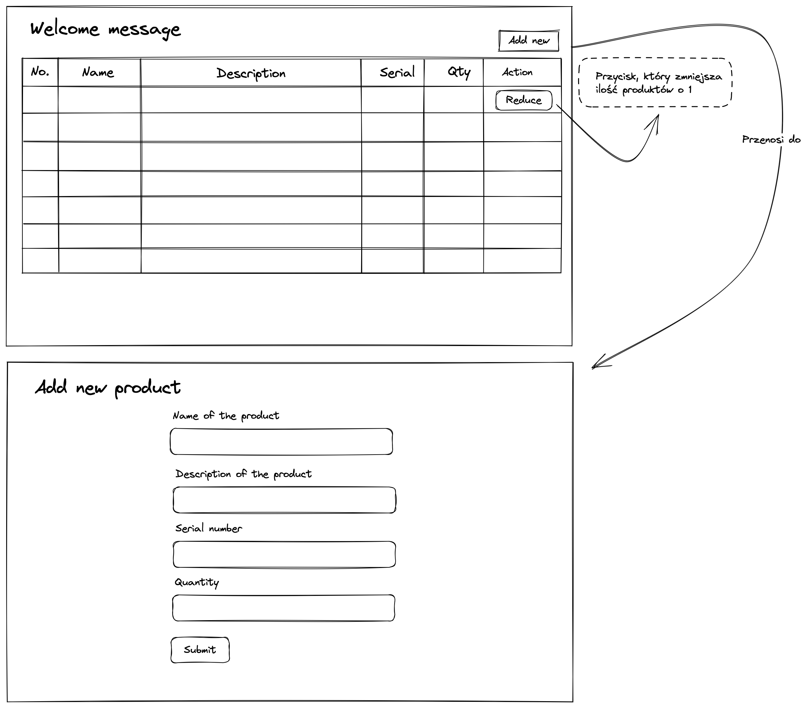
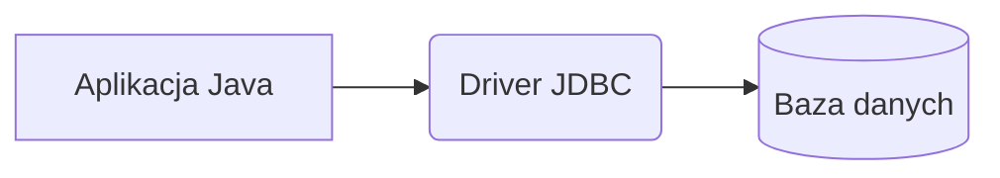

# System zarządzania magazynem
Budujemy aplikację do zarządzania magazynem. Lista funkcjonalności:

- Wyświetlanie informacji o produktach w formie tabeli
- Możliwość dodawania nowych produktów do magazynu
- Możliwość redukcji ilości produktów w magazynie (symulacja kupna)

Założeniem jest zbudowanie aplikacji webowej, która pozwoli na przeglądanie zawartości magazynu oraz modyfikowanie go.

## Warstwa widoku

## Warstwa danych
Dane o produktach będą przechowywane w bazie danych w pamięci RAM. Dzięki temu w łatwy sposób będziemy mogli zapisywać dane do użycia w aplikacji. Jako bazę użyjemy w pełni napisaną w Javie bazę [H2](http://www.h2database.com/html/main.html). Jest to w pełni funkcjonalna baza SQL, która może być zapisana w pliku na dysku - dzięki temu dane zapisane w trakcie działania aplikacji będą dostępne także po jej zrestartowaniu. Dla łatwiejszego zarządzania użyjemy jednak bazy w pamięci RAM. Będzie ona tworzona na nowo za każdym razem gdy uruchomimy aplikację. Dlatego należy pamiętać, że wszystkie zmodyfikowane lub dodane produkty nie będą dostępne po restarcie aplikacji.

Dostęp do warstwy danych (ang. persistence) w Javie możliwy jest dzięki JDBC. Jest to zestaw klas (API), które umożliwiają podłączenie do bazy danych i interakcji z nią za pomocą zapytań SQL.
### JDBC
Java Database Connectivity opiera się na transparentym dostępie do różnych silników baz danych takich jak Postgres, MySQL, Oracle, H2 i inne. Dzięki wykorzystaniu konkretnego drivera kod aplikacji jest niezależny od silnika bazy danych. Kod driver należy dostarczyć jako zależność projektu (biblioteka) w postaci pliku JAR, który można odnaleźć na przykład na [mvnrepository](http://mvnrepository.com).

Diagram użycia JDBC wygląda następująco:


JDBC udostępnia API do kontaktu z bazą danych. Najprostszym sposobem połączenia z bazą danych jest wykorzystanie klasy `DriverManager` oraz stworzenie `Statement`u. Oto przykład:
```java
Connection conn = DriverManager.getConnection("jdbc:h2:mem:test"); // 1
final Statement statement = conn.createStatement(); // 2
final ResultSet resultSet = statement.executeQuery("SELECT * FROM product"); // 3
while (resultSet.next()) {
    // iterowanie po zwróconych rekordach
}
conn.close(); // 4
```
W powyższym kodzie możemy wyróżnić następujące elementy:
1. Połączenie z bazą danych wskazując silnik (w tym wypadku H2) oraz hosta bazy. Jest to tzw. JDBC URL i ma określoną strukturę, która może nieco się różnić w zależności od dostawcy [bazy danych](https://www.baeldung.com/java-jdbc-url-format).
2. Stworzenie obiektu `Statement`, na jego podstawie możemy wywołać zapytanie SQL. 
3. Faktyczne wywołanie zapytania SQL. Jako rezultat dostajemy obiekt typu `ResultSet`. Przechowuje on wiersze zwrócone przez zapytaie SQL.
4. Zamknięcie połączenia. Jest to ważne, ponieważ ilość połączeń do bazy danych jest ograniczona.
#### Obiekt Statement
Klasa `Statement` reprezentuje zapytanie SQL. Wyróżniamy 3 podstawowe typy:
- `Statement`
  - Nie przyjmuje parametrów: po prostu wywołuje zapytanie
  - Idealny do statycznych zapytań – np. tam gdzie nie ma klauzuli WHERE
  - Podatny na [SQL Injection](https://pl.wikipedia.org/wiki/SQL_injection)
```java
Statement statement = con.createStatement();
ResultSet resultSet = statement.executeQuery("SELECT * FROM Products");
```
- `PreparedStatement`
  - Przyjmuje parametry, które są indeksowane **od jedynki**
  - Idealny, gdy chcemy re-używać tego samego zapytania wielokrotnie z innymi parametrami
  - Automatycznie robi escape zarezerwowanych znaków – niepodatny na SQL Injection
```java
PreparedStatement preparedStatement = con.prepareStatement("SELECT serial FROM Products WHERE name LIKE ?");
preparedStatement.setString(1, name);
ResultSet resultSet = preparedStatement.executeQuery();
```
- `CallableStatement`
  - Przyjmuje parametry, które są indeksowane **od jedynki**
  - Używany do wywoływania procedur SQL
```java
CallableStatement callableStatement = con.prepareCall("{ call PROCEDURE(?,?...?)}");
callableStatement.setString(1, name);
ResultSet resultSet1 = callableStatement.executeQuery();
```
Każdy `Statement` ma dostęp do 3 rodzajów metod `execute`:
- `boolean execute(String sql) throws SQLException;`
  - Zwraca:
    - `true` jeśli zapytanie zwróciło jakieś wyniki
    - `false` jeśli było to zapytanie INSERT/UPDATE/DELETE lub gdy zapytanie nie zwróciło wyników
  - Musimy wywołać dodatkowo metody `getResultSet()` lub `getUpdateCount()`
- `ResultSet executeQuery(String sql) throws SQLException;`
  - Zwraca obiekt `ResultSet`, przechowujący wynik zapytania
  - **UWAGA:** nigdy nie zwraca `null`
- `int executeUpdate(String sql) throws SQLException;`
  - Pozwala wywołać tylko zapytania SQL Data Manipulation Language (DML) czyli:
    - INSERT
    - UPDATE
    - DELETE
  - Wyrzuci wyjątek przy zapytaniu SELECT (ogólnie zapytanie, które zwraca ResultSet)
  - Zwraca ilość dodanych/zmodyfikowanych/usuniętych rekordów
    - Jeśli zwracana wartość jest większa niż `Integer.MAX_VALUE` powinniśmy użyć `executeLargeUpdate()`
#### ResultSet
Przechowuje rekordy zwrócone przez zapytanie SQL. Działa na zasadzie kursorów. Każde wywołanie metody `boolean next()` przenosi kursor do następnego rekordu. Wygląda to następująco: na początku kursor ustawiony jest przed wszystkimi wierszami w `ResultSet`. Dlatego zawsze musimy wyołać `next()` przed próbą pobrania wartości.

|     | Column 1      | Column 2               | Column n |
|-----|---------------|------------------------|----------|
| ->  |               |                        |          |
|     | Xbox          | This Xbox              | 123-4445 |
|     | PlayStation 5 | This is PlayStation 5  | 441-5222 |
Po wywołaniu `next()` kursor przenosi się do pierwszego wiersza, a przy każdym wywołaniu do następnego:

|     | Column 1      | Column 2               | Column n |
|-----|---------------|------------------------|----------|
|     |               |                        |          |
| ->  | Xbox          | This Xbox              | 123-4445 |
|     | PlayStation 5 | This is PlayStation 5  | 441-5222 |

Przykład wyciągania danych z każdego wiersza poniżej. Każdy typ kolumny powinien odpowiadać metodzie `get`*:
```java
final ResultSet resultSet = conn.prepareStatement("SELECT * FROM product").executeQuery();
while (resultSet.next()){
    long id=resultSet.getLong("id");
    String name=resultSet.getString("name");
    String desc=resultSet.getString("desc");
    String serial=resultSet.getString("serial");
    int qty=resultSet.getInt("qty");
}
```
#### Podsumowanie
| Zalety | Wady |
|--------|------|
|Proste wywoływanie zapytań|Uciążliwy w dużych aplikacjach|
|Wydajność|Musimy znać składnię zapytań|
|Świetnie sprawdza się w małych aplikacjach|ResultSet|
|Łatwy do nauczenia||
## Warstwa aplikacji
Do obsługi aplikacji WEBowej użyty zostanie `HttpServer` dostępny w JDK. Jest to proste narzędzie do budowania aplikacji obsługujących żądania HTTP.
